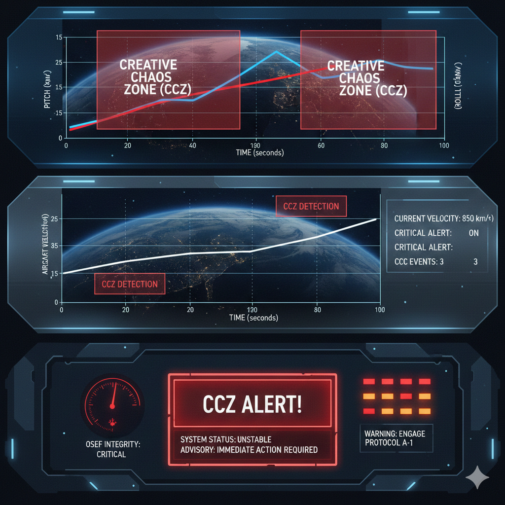
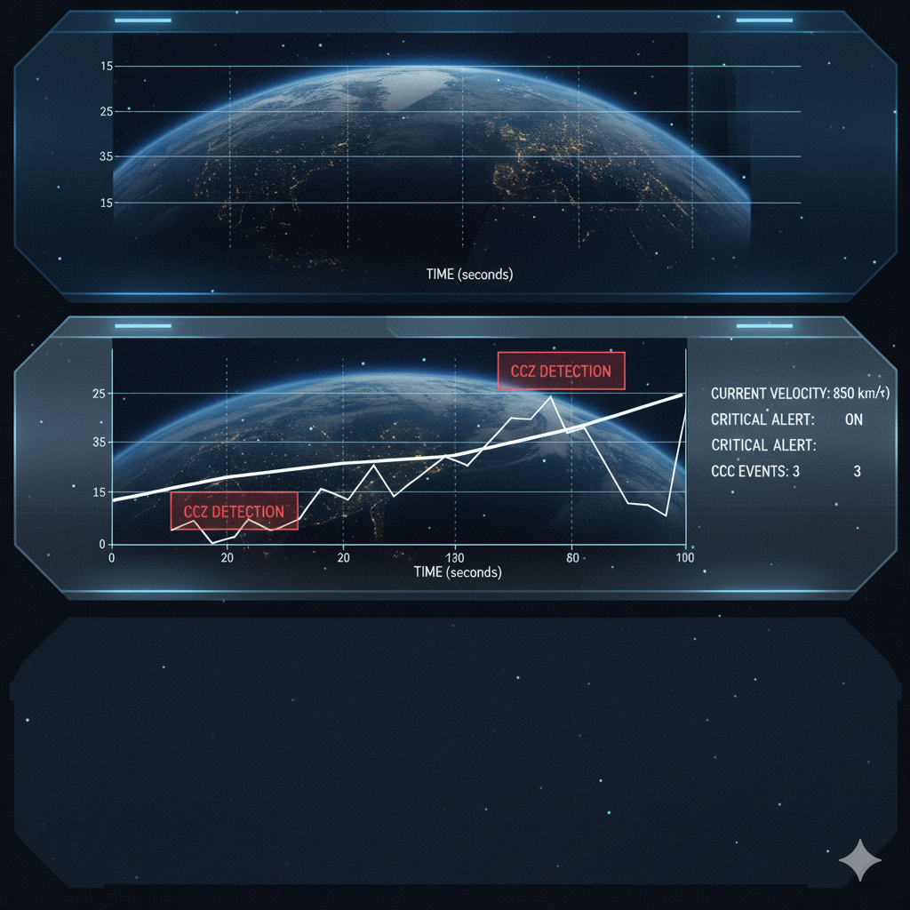

# OSEF Simulation Framework

Operational Stability Envelope Framework (OSEF) for real-time aircraft simulation and advisory visualization.

---

## ⚙️ Features

- Simulate aircraft state variables: velocity, pitch, roll, yaw, and rotational rates.  
- Handle pilot inputs via keyboard or joystick.  
- Model environmental effects: wind, turbulence, and gusts.  
- Detect and alert Creative Chaos Zones (CCZ) and Limit Cycles.  
- Real-time visualization of pitch, roll, and velocity.  
- Interactive cockpit-style advisory dashboard.  
- Modular structure for easy extensions and integration.  

---

## 🖥️ Example Screenshots

**All images are stored in the `pictures/` folder.**

### 1. Pitch & Roll Animation
  

### 2. Velocity & CCZ Alerts
  

### 3. Advisory Dashboard
  

> Note: Images above are placeholders. Replace with actual screenshots after running the simulation.

---

## 🚀 Getting Started

### 1. Clone the repository
```bash
git clone https://github.com/emerladcompass/OSEF-Framework.git
cd OSEF-Framework/OSEF-Simulation

2. Install dependencies

pip install -r requirements.txt

3. Run the simulation

python main.py


---

📂 Folder Structure
'''
OSEF-Simulation/
│
├── README.md
├── requirements.txt
│
├── simulation/              # Aircraft simulation modules
│   ├── __init__.py
│   ├── aircraft_model.py    # Aircraft state + dynamics
│   ├── pilot_input.py       # Pilot inputs (Keyboard / Joystick)
│   ├── environment.py       # Environmental disturbances (Wind / Gusts)
│   └── limit_cycle.py       # Detect CCZ & Limit Cycles
│
├── visualization/           # Visualization & Dashboard
│   ├── __init__.py
│   ├── dashboard.py         # Advisory cockpit dashboard
│   └── animator.py          # Animated Pitch / Roll / Velocity plots
│
├── main.py                  # Entry point for running the simulation
└── pictures/                # Folder for screenshots and visual assets
'''

---

📄 License

This project is licensed under the MIT License. See the LICENSE file for details.

---
